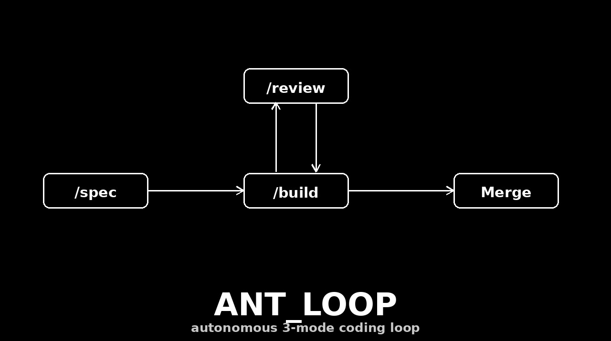

# ANT Loop (Autonomous Coding Loop)



Every feature flows through three modes. The **only human steps** are: give an idea via `/spec`, and approve via 🚀 reaction.

```
/spec ──▶ /build ⇄ /review ──▶ Merge (🚀)
              ▲________________│
   (review loops back to build on blocking issues)
```

## Modes

### /spec
1. Ask clarifying questions until the requirement is fully understood (use `interview-me` if stuck).
2. Write a spec doc: goal, acceptance criteria, edge cases, tech-stack notes, success metrics.
3. Log it as an issue in the tracker with status label **`spec-ready`**.
4. Do NOT build yet — let /build pick it up.

### /build (autonomous, poll-based)
- Monitor the tracker for `spec-ready` issues.
- For each: implement fully, following the `backend-developer` playbook + existing architecture/style. Clean, commented code, with tests.
- On completion: set status **`built`**; the /review mode picks it up by polling.

### /review (autonomous, poll-based)
- Monitor `built` issues.
- Review for security, performance, bugs, best practices (use `code-review-and-quality`).
- Run tests, including browser tests where a UI exists.
- Write step-by-step test instructions.
- Capture screenshots of key functionality (`browser_vision`).
- Open a Pull Request with a clear title + description.
- Deploy a preview (Adapter: Vercel or local sandbox).
- Send a notification (Adapter: Telegram/Slack) containing:
  - Executive summary of changes
  - PR link
  - Full test steps
  - Preview/sandbox link
  - Screenshots
- Wait for 🚀 approval → merge the PR, set status **`shipped`/`done`**.

## Merge Protocol
- After the notification, wait for the human 🚀 reaction (or `/ship <issue>` command fallback).
- On approval: merge PR, close issue as Done/Shipped, post a short confirmation.

## Adapters (configurable per project — set once, then the loop runs)
- **Tracker**: GitHub Issues (default, via `gh`) with labels `spec-ready` / `built` / `shipped`. Alternative: local Markdown board at `~/.hermes/profiles/ant_swe/loop/board.md`.
- **Messaging**: Telegram (default — our channel). Alternative: Slack via incoming webhook.
- **Deploy**: Vercel (if a token is configured) else a local preview server (`npm run dev` / static serve) with its URL.
- **Approval**: Telegram 🚀 reaction OR reply `/ship <id>` (fallback when reactions aren't detectable in-session).

## How "parallel sessions" are realized in Hermes
- `/spec` runs interactively when Rish invokes it.
- `/build` and `/review` run as **cron jobs** (`build-monitor`, `review-monitor`) that poll the tracker and spawn a subagent via `delegate_task` to do the actual work. This is the working equivalent of "separate sessions running in parallel."

## Core Rules
- Only human actions: `/spec` idea + 🚀 approve.
- Be proactive: once a spec exists, never wait for extra instructions.
- High code quality is the loop's full responsibility — test + review before the human sees anything.

## Failure-Plan (build in the safeguard)
- Build fails tests → do NOT mark `built`; log the error in the issue, notify, retry once, then escalate to human.
- Review finds a critical issue → block the merge, reopen as `spec-ready` with notes.
- Deploy fails → fall back to a local sandbox and note it in the notification.
- Tracker/notify down → write to the local board + log; retry.

---

**Daily improvement:** a daily cron reviews the day's loop runs and patches both this skill and `backend-developer` with real lessons learned.

---

## Dependencies (now bundled — stands alone)

This skill is the **orchestration layer** of the ANT Loop. The two workers it
delegates to now ship in this repo alongside it, so the loop is self-contained:

- **`backend-developer`** (`skills/backend-developer/`) — the build playbook
  `/build` follows (architecture, style, testing conventions).
  Load with `skill_view backend-developer`.
- **`code-review-and-quality`** (`skills/code-review-and-quality/`) — the review
  gate `/review` runs (security, performance, bugs, best practices).
  Load with `skill_view code-review-and-quality`.

A ready-made `board.example.md` (template for the local Markdown tracker) also
ships in this folder. Load all three skills together for the full self-driving
loop: `skill_view ant-loop`, then `skill_view backend-developer`, then
`skill_view code-review-and-quality`.
